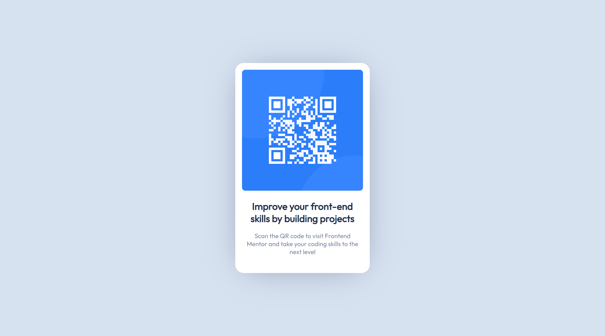

# Frontend Mentor - QR code component solution

This is a solution to the [QR code component challenge on Frontend Mentor](https://www.frontendmentor.io/challenges/qr-code-component-iux_sIO_H). Frontend Mentor challenges help you improve your coding skills by building realistic projects. 

## Table of contents

- [Overview](#overview)
  - [Screenshot](#screenshot)
  - [Links](#links)
- [My process](#my-process)
  - [Built with](#built-with)
  - [What I learned](#what-i-learned)
  - [Continued development](#continued-development)
  - [Useful resources](#useful-resources)
- [Author](#author)

## Overview

### Screenshot



### Links

- Solution URL: [GitHub](https://github.com/cuishuo0102/qr-code-component)
- Live Site URL: [GitHub Pages](https://cuishuo0102.github.io/qr-code-component)

## My process

### Built with

- Semantic HTML5 markup
- [React](https://reactjs.org/) - JS library
- [Vite](https://vitejs.dev) - Module bundler
- SCSS
- Webfont
- PixelPerfect -  Web design validator

### What I learned
Using SCSS variables can make style maintenance work more easy

```css
$size: $card-w - (2 * $card-padding);
```

### Continued development

- Using CSS Grid to implement card layout

### Useful resources

- [How to add fonts to create-react-app based projects?](https://www.example.com) - This helped me for adding web font to web site.
- [SCSS](https://sass-lang.com/) - The official document helped me with the syntaxes and styles rules of SCSS.
- [Understanding the “Initial”, “Inherit” and “Unset” CSS Keywords](https://elad.medium.com/understanding-the-initial-inherit-and-unset-css-keywords-2d70b7121695) - This is an awesome article that helped me finally understand the initial and unset keywords of CSS.


## Author

- Website - [cuishuo0102](https://github.com/cuishuo0102)
- Frontend Mentor - [@cuishuo0102](https://www.frontendmentor.io/profile/cuishuo0102)
